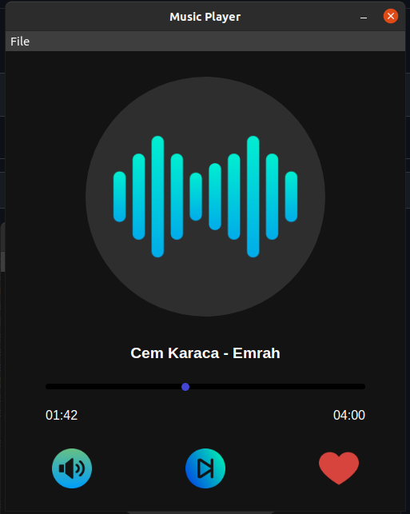
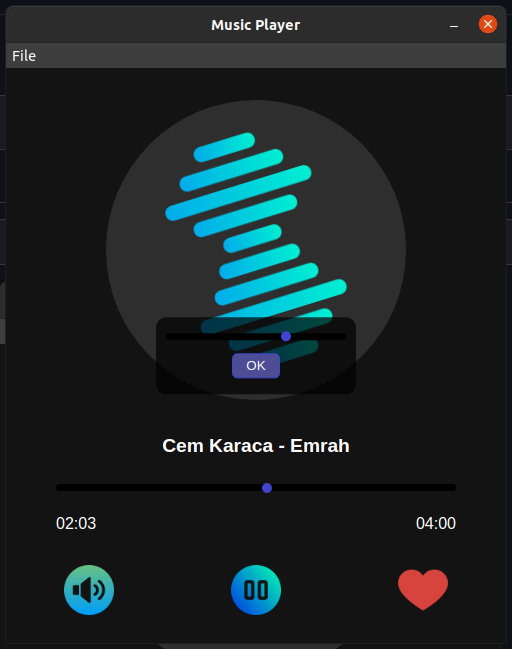

# Music Player
| Simple Music Player using Electron.js

### Functions:
* Open Music
* Play/Pause Music
* Choose the time you want
* Add music to favorites
* Remove music from favorites
* Volume Control

#### Expected functions:
* Create Playlist
* More minimal and beautiful design

### Screenshots:

#### Volume Control

#### If you liked the project, please give star.
