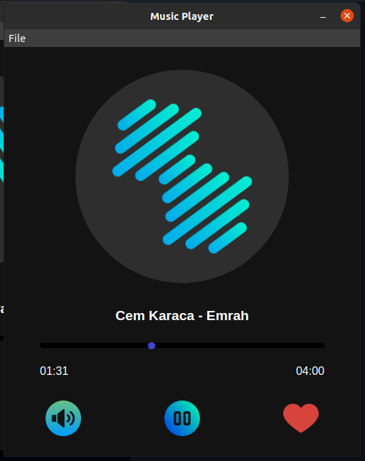

# Music Player
| Simple Music Player using Electron.js

### Functions:
* Open Music
* Play/Pause Music
* Choose the time you want
* Add music to favorites
* Remove music from favorites

#### Expected functions:
* Create Playlist

### Screenshot:

